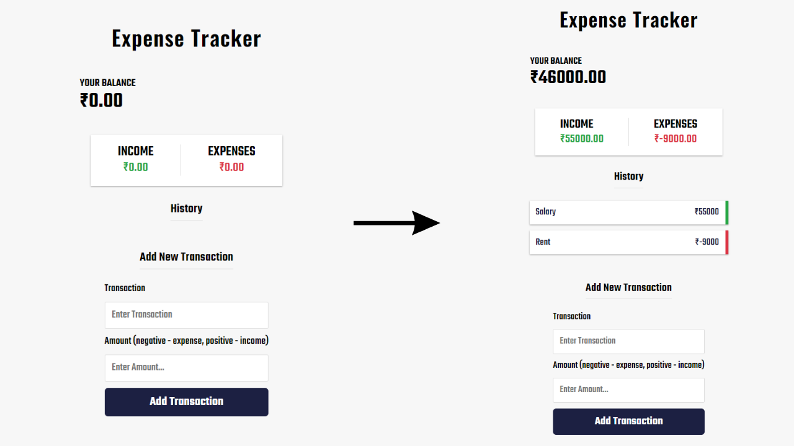

# Expense Tracker - Vanilla JS

## Table of Contents

- [Links](#links)
- [Description](#description)
- [Screenshot](#screenshot)
- [Demo](#demo)
- [Features](#features)
- [Technologies Used](#technologies-used)
- [How It Works](#how-it-works)
- [Usage](#usage)
- [Project Structure](#project-structure)
- [Credits](#credits)
- [Note](#note)
- [Contributing](#contributing)

## Links

- Solution URL: [GitHub Repository](https://github.com/aruntutter/expense-tracker)
- Live Demo: [Live Demo URL](https://nimble-taffy-71512b.netlify.app/)

## Description

The Expense Tracker is a web application built using Vanilla JavaScript that helps you keep track of your income and expenses. You can add transactions, categorize them as income or expenses, and see your balance update in real-time.

## Screenshot

## Demo

You can access the live demo of the Expense Tracker at [Live Demo URL](https://nimble-taffy-71512b.netlify.app/).

## Features

- Add Transaction: Allows you to add new income or expense transactions.
- Real-time Balance: Shows your current balance that updates with every transaction.
- Categorized Display: Transactions are categorized as income (green) or expenses (red) for easy identification.
- Delete Transactions: You can delete specific transactions from the history.

## Technologies Used

- HTML
- CSS
- JavaScript
- **DOM Manipulation**: Utilized DOM manipulation techniques to dynamically update the user interface.
- **LocalStorage**: Used to store transaction data locally in the browser.
- **FontAwesome**: Utilized FontAwesome icons for improved visual representation.

## How It Works

- When the page loads, the Expense Tracker initializes with an initial balance of ₹0.00.
- You can add transactions using the "Add New Transaction" form. Enter the transaction name and amount, specifying whether it's income or an expense.
- The balance, income, and expense sections dynamically update based on the transactions you add.
- You can see a history of transactions in the "History" section, with each transaction displayed along with its category and amount.
- The "Delete" button allows you to remove specific transactions from the history.

## Usage

1. Open the live demo of the Expense Tracker using the provided link.
2. Use the "Add New Transaction" form to add your income and expense transactions.
3. The "Your Balance" section will reflect the updated balance after each transaction.
4. The "Income" and "Expenses" sections will show the total income and total expenses, respectively.
5. The "History" section will display a list of your transactions along with the transaction category and amount.
6. Use the "Delete" button next to each transaction to remove it from the history.

## Project Structure

- `index.html`: Contains the HTML structure of the Expense Tracker.
- `styles/normalize.css`: Normalize.css for consistent styling across different browsers.
- `styles/style.css`: Custom CSS styles for the Expense Tracker.
- `assets/images`: Directory containing images used in the project.
- `scripts/script.js`: JavaScript code for handling transaction data, UI updates, and user interactions.

## Credits

- FontAwesome: Used for adding stylish icons to the UI elements.
- Google Fonts: Utilized for the "Teko" and "Oswald" font families for improved typography.
- MDN Web Docs: Invaluable resource for understanding and utilizing JavaScript and DOM methods.

## Note

Make sure to keep track of your expenses responsibly and avoid storing sensitive information in the browser's local storage.

Feel free to use and customize this Expense Tracker for your financial management needs!

## Contributing

Contributions are welcome! If you find any issues, have suggestions for improvements, or want to add new features, please open an issue or submit a pull request in the GitHub repository. Let's enhance this project together and make it more useful!